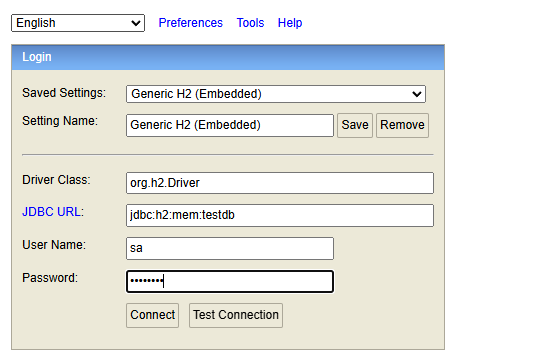
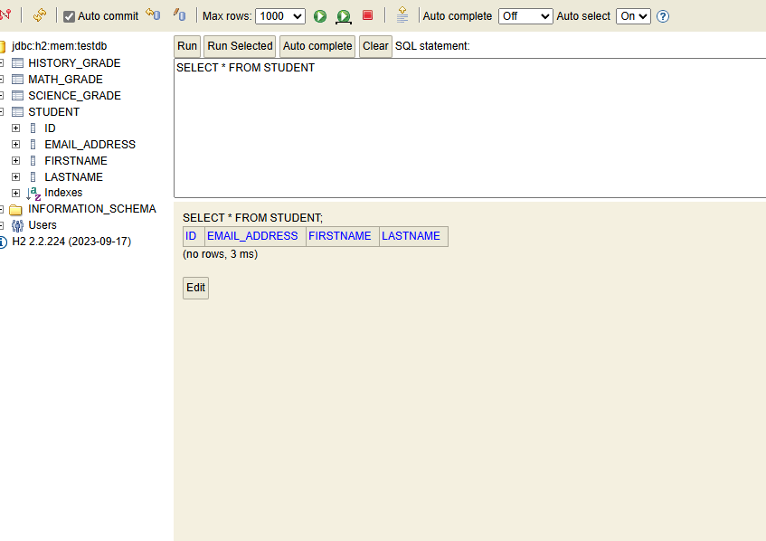

As we start, we do not have our DAOs set up so for them, we will use Spring Data JPA.

And for database, we will use an in-memory H2 database. An in-memory database is good for testing so you can quickly set it up and tear it down. Moreover, there is no network latency so tests run faster.

The very first step is ofcourse to create a new "test" directory in our "src" folder. This directory will have a "java" folder and inside that, we will create a new package that has same name as the package in the "main -> java" folder. And in that we will write our test classes. 

So, let's setup up our first test class named "StudentAndGradeServiceTest" - 

    @TestPropertySource("/application.properties")
    @SpringBootTest
    public class StudentAndGradeServiceTest {

        @Test
        public void createStudentService() {

        }
    }

Since we want our tests to drive the development, we can write - 

    @Test
    public void createStudentService() {
        studentService.createStudent("John", "Doe", "johndoe@gmail.com");

        CollegeStudent student = studentRepository.findByEmailAddress("johndoe@gmail.com");

        assertEquals("johndoe@gmail.com", student.getEmailAddress(), "Find by email");
    }

At this point, the IDE will show errors because we do not have a student service or a student repository yet. So, we will now create these classes.

# CREATING A SERVICE AND REPOSITORY

As we have done countless time already, we first define a new service interface and then a class that implements that interface -

    public interface StudentAndGradeService {
        public void createStudent();
    }

    @Service
    @Transactional
    public class StudentAndGradeServiceImpl implements StudentAndGradeService{

        @Override
        public void createStudent(String firstName, String lastName, String email) {

            CollegeStudent student = new CollegeStudent(firstName, lastName, email);

            studentRepository.save(student);
        }
    }

Again, we have a problem here because we do not have a "studentRepository" yet. So, let's create one - 

    @Repository
    public interface StudentRepository extends CrudRepository<CollegeStudent, Integer> {
        public CollegeStudent findByEmailAddress(String email);
    }

Note that since we are using Spring Data JPA, we do not need to implement the "findByEmailAddress" method as Spring will do that based on the method name itself.

And now, we can autowire this in the Service class and then our code is complete - 

    @Service
    @Transactional
    public class StudentAndGradeServiceImpl implements StudentAndGradeService{
        
        StudentRepository studentRepository;
        
        @Autowired
        public StudentAndGradeServiceImpl(StudentRepository studentRepository) {
            this.studentRepository = studentRepository;
        }

        @Override
        public void createStudent(String firstName, String lastName, String email) {

            CollegeStudent student = new CollegeStudent(firstName, lastName, email);

            studentRepository.save(student);
        }
    }

And finally, we can now autowire the service and repository dependencies in our test class - 

    public class StudentAndGradeServiceTest {

        @Autowired
        StudentAndGradeService studentService;

        @Autowired
        StudentRepository studentRepository;

        @Test
        public void createStudentService() {
            studentService.createStudent("John", "Doe", "johndoe@gmail.com");

            CollegeStudent student = studentRepository.findByEmailAddress("johndoe@gmail.com");

            assertEquals("johndoe@gmail.com", student.getEmailAddress(), "Find by email");
        }
    }

Now, when we run this test, we see that the test passed. But wait, we did not even configure our database yet. How did the test still pass?

The thing is, in Spring Boot, if an embedded database is a dependency, then SPring Boot will automatically configure the database connection.

If you look at the pom.xml file, we have an "H2" dependency and so, Spring Boot automatically configures the connection to an embedded H2 database.

And that's the reason why our test passed because there is a database that Spring has automatically configured.

# DATABASE INITIALIZATION AND CLEANUP

Whenever we perform an integration testing with a database, each test should run from a known state. Before each test, we should perform initialization. For example, insertion of data.

And after each test, we should perform cleanup. For example, deletion of sample data.

For this, we can use the annotations such as @BeforeEach, @AfterEach etc.

    @Autowired
    private JdbcTemplate jdbcTemplate;
    
    @BeforeEach
    public void setupDatabase () {
        CollegeStudent student = new CollegeStudent("Eric", "Roby","ericroby@gmail.com");
        studentRepository.save(student);
    }

    @AfterEach
    public void cleanDatabase() {
        studentRepository.deleteAll();
        jdbcTemplate.execute("ALTER TABLE student ALTER COLUMN ID RESTART WITH 1");
    }

Note that here, while we used the Spring Data JPA to save and delete the student. But in the @AfterEach, we also use "JdbcTemplate" because after we clear the table, we want to make sure any new insertion will insert a row with id as "1". Because if we do not do that, the id of the new row will always keep incrementing, even if it is the first row in this table.

# TEST IF DATA EXISTS IN THE DATABASE

Now, let's write a test that will test if the student with id "1" exists in the database or not.

    @Test
    public void isStudentNullCheck() {
        assertTrue(studentService.checkIfStudentExists(1));
        assertFalse(studentService.checkIfStudentExists(0));
    }

Now, at this point, we do not have a method in our service that is named "checkIfStudentExists" so we will create that.

    @Override
    public boolean checkIfStudentExists(int id) {
        Optional<CollegeStudent> student = studentRepository.findById(id);
        return student.isPresent();
    }

And now, we see that the test will pass. That's because in the @BeforeEach, we are creating and saving a new student in the database and the id is given as "0". So, if we search a student with id 0, we will get a valid student hence "assertTrue" will be true for "checkIfStudentExists(0)". But there is no student with id as "1" so "checkIfStudentExists(1)" will return us False.

# TEST DELETION OF DATA FROM TEH DATABASE

Let's write another test, this time to test deletion of a student.

    @Test
    public void deleteStudentTest() {
        assertTrue(studentService.checkIfStudentExists(1), "Student with id 1 should exist in the database");

        studentService.deleteStudent(1);

        assertFalse(studentService.checkIfStudentExists(1), "Student with id 1 should no longer exist in the database");
    }

And again, we need to add a method "deleteStudent" in our service.

    @Override
    public void deleteStudent(int id) {
        if (checkIfStudentExists(id)) {
            this.studentRepository.deleteById(id);
        }
    }

# REVIEWING APPLICATION PROPERTIES

We have some "H2" related properties in our application.properties file that are commented out initially - 

    #spring.datasource.url=jdbc:h2:mem:testdb
    #spring.datasource.driverClassName=org.h2.Driver
    #spring.datasource.username=sa
    #spring.datasource.password=password
    #spring.datasource.initialization-mode=always
    #spring.jpa.database-platform=org.hibernate.dialect.H2Dialect
    #spring.h2.console.enabled=true
    #spring.jpa.hibernate.ddl-auto=create-drop
    #spring.jpa.show-sql = true

What are all these?

Let's uncomment them and know what all they do. The first four are something we already know - 

    spring.datasource.url=jdbc:h2:mem:testdb
    spring.datasource.driverClassName=org.h2.Driver
    spring.datasource.username=sa
    spring.datasource.password=password

They are just to set up the database with username, password, driver and URL.

Next up, we have a property named - 

    spring.datasource.initialization-mode=always

This property will automatically create the database schema regardless of the DataSource type.

Next, we have - 

    spring.jpa.database-platform=org.hibernate.dialect.H2Dialect

As we know, SQL databases like Oracle, MySQL etc have some differences here and there so with this property, we are saying use the "H2" Dialect because we are using the H2 database.

    spring.h2.console.enabled=true

This will enable the web console of the H2 database for our project.

Then we have this - 

    spring.jpa.hibernate.ddl-auto=create-drop

This will drop the existing tables and create new tables. After the operations are done, it drops the database schema. And this is commonly used for Integration testing.

    spring.jpa.show-sql = true

This will show all the SQL statements in the logs.

Once you uncomment all and run your spring app, you can actually go to -

    localhost:1500/h2-console

And this will open a new page where you can enter the password and the database url (same url as the application.properties file) and connect.

And now, you will see a whole console on your screen with all the tables.

Moreover, if you run your test class, you will also see the actual SQL statements that are executed by JPA / Hibernate in the terminal.

# TESTING COUNT OF STUDENTS IN TABLE

Let's write a test that fetches all the students in the table -

    @Test
    public void getGradebookService() {
        Iterable<CollegeStudent> iterableCollegeStudent = studentService.getGradebook();

        List<CollegeStudent> studentList = new ArrayList<>();

        iterableCollegeStudent.forEach(studentList::add);

        assertEquals(1, studentList.size(), "Only one student should be present in the database table");

    }

Again, we will have to define a new method named "getGradebook" - 

    @Override
    public Iterable<CollegeStudent> getGradebook() {
        return studentRepository.findAll();
    }

And this will also pass because we have only one student for each test as we only add one student before each test and we delete all the rows when test is complete.

# @Sql ANNOTATION

Now, what if we want to add some rows to our table only for this test? We do not want to do this for each test. So, we cannot add any rows in the @BeforeEach method.

How do we do it?

Well, we can create a new sql file which has the SQL query we want to be executed for this specific test.

We will have this .sql file in the "resources" folder (not the resources folder of "main" but of the "test" directory) - 

Let's call it "insertData.sql" -

    insert into student(id, firstname, lastname, email_address)
    values
        (11, 'Student', 'One', 'studentone@gmail.com'),
        (12, 'Student', 'Two', 'studenttwo@gmail.com'),
        (13, 'Student', 'Three', 'studentthree@gmail.com'),
        (14, 'Student', 'Four', 'studentfour@gmail.com');

And now, for our "getGradebookService()" test, we can use an annotation on this method named "@Sql" and pass the path of this .sql file as input - 

    @Test
    @Sql("/insertData.sql")
    public void getGradebookService() {
        Iterable<CollegeStudent> iterableCollegeStudent = studentService.getGradebook();

        List<CollegeStudent> studentList = new ArrayList<>();

        iterableCollegeStudent.forEach(studentList::add);

        assertEquals(5, studentList.size(), "Only one student should be present in the database table");

    }

And now, you will see that our test will pass because now, we have five total rows in our database table.

That's because one row is added using @BeforeEach and the rest four rows are added using the query in the sql file.

If you are wondering whether @BeforeEach runs first of @Sql, then note that @BeforeEach will execute first. Then, @Sql will execute.